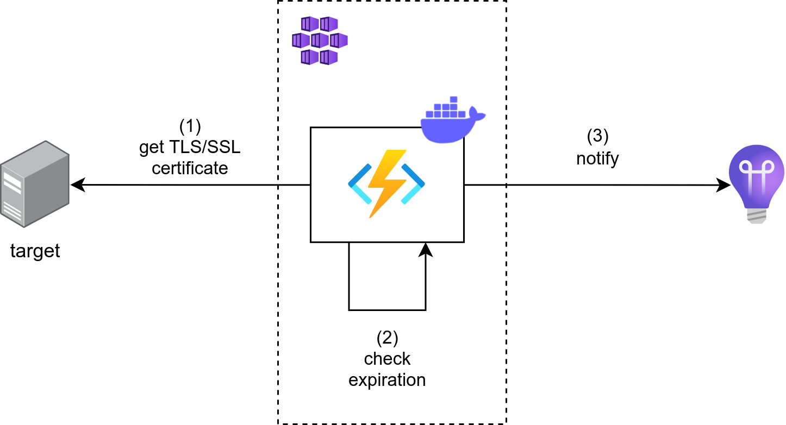

# TLS/SSL certificate check

Containerized service to check a TLS/SSL certificate expiration.



## Envs

| Name | Description | Mandatory |
| - | - | - |
| FUNCTIONS\_WORKER\_RUNTIME | Azure Function specific variable | Yes |
| APPINSIGHTS\_INSTRUMENTATIONKEY | Azure Function specific variable | Yes |
| AzureWebJobStorage | Azure Function specific variable | Yes |
| TIME\_TIGGER | A [cron expression](https://docs.microsoft.com/en-us/azure/azure-functions/functions-bindings-timer?tabs=in-process&pivots=programming-language-csharp#ncrontab-expressions) or a [time span](https://docs.microsoft.com/en-us/azure/azure-functions/functions-bindings-timer?tabs=in-process&pivots=programming-language-csharp#timespan) to schedule the function | Yes |
| FunctionName | Name to use in the Application Insights' Availability blade | Yes |
| Region | Region of the Application Insights instance | Yes |
| ExpirationDeltaInDays | How many days before certificate expiration the service will notify Application Insights | Yes |
| Host | The host of the certificate to check (i.e. https://google.com) | Yes |

## Development

To develop new feature you can use **Docker compose**. Remember to create a `.env` file like this one:

```
FUNCTIONS_WORKER_RUNTIME = "dotnet"
TIME_TRIGGER = "0 * * * * *"
APPINSIGHTS_INSTRUMENTATIONKEY = "<connection_string>"
AzureWebJobsStorage = "UseDevelopmentStorage=true"
FunctionName = "https://google.com"
Region = "West Europe"
ExpirationDeltaInDays = 15
Host = "https://google.com"
```


